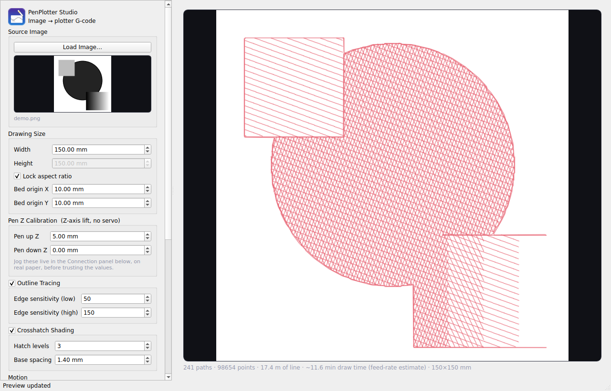

# PenPlotter Studio

A desktop app that converts images into G-code for a pen-plotter conversion
of an Ender 3 V2 (or similar) — the printer's own **Z axis** lifts and lowers
the pen, so there's no servo, no custom firmware, and no heater commands
involved. Outline tracing, adjustable crosshatch shading, a live preview of
the actual pen strokes, and optional direct serial streaming to the machine.



## Features

- Load any image, get a live preview of the actual paths that will be drawn
  (not just the source image) as you adjust settings.
- Tone pipeline (auto-levels, local contrast/CLAHE, edge-preserving
  denoise, brightness/contrast/gamma/shadow-weight) so photos —
  not just high-contrast line art — reproduce well.
- Outline tracing (Canny edge detection) for clean linework.
- Two shading engines, pick one:
  - **Crosshatch** — tone-mapped layered hatch lines; the number of
    overlapping directions tracks image darkness.
  - **Dots (stipple)** — error-diffused dot shading; the whole image is
    rendered as pen taps, denser where it's darker.
- Transparent-PNG cut-outs are detected from their alpha channel; opaque
  JPEG backdrops via a fixed-range flood fill that doesn't leak into the
  subject.
- Orientation controls (vertical flip / horizontal mirror) so the print
  comes off the bed the same way up as the preview, plus per-side
  unusable-margin fields and paper-size presets that keep every move
  inside the reachable area.
- Emits `M107` so the head fan stays off, tracks pen state so no pen-down
  move is wasted, and drops hatch fragments too short to be worth a
  pen lift.
- Export standalone `.gcode`, or stream it straight to the machine over
  serial with a progress bar and live log.
- Runs on Linux (AppImage) and Windows (`.exe`); source is plain
  cross-platform Python/Qt, so macOS works too if you build it yourself.

## Repo layout

```
src/                    the application (main.py, gcode_core.py, theme.py)
cli/                    command-line front-end (imports src/gcode_core.py)
tools/                  gcode_preview.py -- render a .gcode to PNG (dev aid)
resources/              icons (png + ico)
packaging/linux/        build_appimage.sh -> PenPlotterStudio-x86_64.AppImage
packaging/windows/      build.bat / build_debug.bat -> PenPlotterStudio.exe
docs/                   screenshots etc.
```

## Quick start — run from source (any OS)

```bash
pip install -r requirements.txt
python src/main.py
```

## Building a distributable

**Linux (AppImage):**
```bash
bash packaging/linux/build_appimage.sh
```
Produces `packaging/linux/PenPlotterStudio-x86_64.AppImage`. The script
installs its own Python dependencies, runs PyInstaller, bundles
`libxcb-cursor` and friends (Qt 6.5+ needs it and not every distro has it by
default), and downloads `appimagetool` automatically if it's not already
next to the script.

**Windows (.exe):**
```
packaging\windows\build.bat
```
Requires Python 3.11+ installed with "Add python.exe to PATH" checked.
Produces `packaging\windows\dist\PenPlotterStudio.exe`. If something crashes
and you need the real error instead of a silent window close, use
`build_debug.bat` instead and run the resulting exe from a Command Prompt
window (not by double-clicking) so the console stays open.

**CLI only (no GUI dependencies):**
```bash
pip install opencv-python-headless numpy
python cli/image_to_gcode.py input.jpg output.gcode --width-mm 180
python cli/image_to_gcode.py photo.jpg dots.gcode --shading stipple --no-outline
```
The CLI imports the same engine from `src/gcode_core.py` that the GUI uses,
so output is identical. Run `--help` for all flags.

## Hardware assumption

This targets a plotter conversion that uses the machine's **existing Z
axis** to lift/lower the pen (no servo). Because the G-code this produces
never sends a heater command, stock Marlin's thermal-runaway protection is
never triggered — no firmware changes needed on a typical Ender 3 V2. The
output also sends `M107` so the part-cooling fan on the (now unused)
hot-end assembly doesn't spin during a draw.

Defaults assume A4 on a 220 × 220 bed with the right ~10 mm (past X = 210)
left unusable; all of that is adjustable in **Paper & Placement** and
**Bed & Unusable Margins**.

---

## Settings reference

### Source Image
**Load Image…** — opens a file picker (PNG/JPG/BMP/TIFF/WebP). This is the
only required input; everything else has a sensible default. A transparent
PNG cut-out is used directly as the subject mask.

### Paper & Placement
| Setting | Range | Default | What it does |
|---|---|---|---|
| Paper | preset list | A4 portrait | Sheet size. `Custom / whole bed` ignores paper and uses the whole reachable bed. |
| Max width / Max height | 10–500 mm | 180 | Upper bound on drawing size. The drawing is scaled down (aspect preserved when the lock is on) so it fits **both** the sheet minus the margin **and** the reachable bed area — so a portrait A4 request that would be 268 mm tall is quietly capped at the ~220 mm the machine can reach. |
| Lock aspect ratio | — | on | Off = use the explicit Max height, uniform-scaled to fit. |
| Margin from paper edge | 0–100 mm | 10 | Keep-out band between the drawing and the paper edge. |

### Bed & Unusable Margins
| Setting | Range | Default | What it does |
|---|---|---|---|
| Bed width / height | 10–1000 mm | 220 / 220 | Physical bed travel. |
| Unusable left / right / front / back | 0–200 mm | 0 / 10 / 0 / 0 | Strips the head can't reach or shouldn't enter. Default clears the 10 mm dead column past X = 210 on a typical Ender 3 V2. The drawing is centered in whatever rectangle is left. |
| Center in reachable area | — | on | Off = place the drawing at an explicit Origin X / Y (still clamped inside the reachable rectangle). |

### Orientation
| Setting | Default | What it does |
|---|---|---|
| Flip vertical so the print matches the preview | on | The Ender 3's +Y is toward the back. With this on, the top of the image is sent to the back of the bed, so the finished drawing reads right-side-up when you look at the machine from the front — and the exported file still previews right-side-up in a G-code viewer. Turn it off only if your machine's Y is inverted. |
| Mirror horizontal | off | Also flips left↔right, for a machine that comes out mirrored (effectively a 180° rotation when combined with the vertical flip off). |

### Pen Z Calibration (Z-axis lift, no servo)
| Setting | Range | Default | What it does |
|---|---|---|---|
| Pen up Z (hop) | 0–50 mm | **3** | Height the pen lifts to between strokes / dots. Must clear the paper; 3 mm is plenty for flat paper and keeps dot mode fast. |
| Pen down Z | -10–50 mm | 0 | Height where the pen tip touches paper with the right pressure. **Specific to your pen and holder** — use the **Pen Up / Pen Down** jog buttons on real paper to find it. |

### Tone / Image Recognition
Run before any pass. This is what makes photos (not just line art)
reproduce; sweeping the outline sensitivity alone never touched shading.

| Setting | Range | Default | What it does |
|---|---|---|---|
| Brightness | -120–120 | 0 | Flat add to every pixel after the automatic steps. |
| Contrast | 0.3–3.0 | 1.0 | Multiplier around mid-grey. |
| Gamma | 0.3–3.0 | 1.0 | <1 lifts shadows, >1 deepens them. |
| Shadow weight | 0.5–2.0 | 1.0 | Scales how strongly darkness drives hatch layering / dot density without changing the tone image itself. |
| Auto levels | — | on | Stretches the 2nd–98th brightness percentiles to full range — fixes flat, hazy phone photos. |
| Local contrast (CLAHE) | — | on | Adaptive local histogram equalization — pulls detail out of shadow and highlight at once. |
| Edge-preserving denoise | — | on | Bilateral filter: kills JPEG/sensor noise that would otherwise become stray marks, without softening real edges. |

### Background Detection
| Setting | Range | Default | What it does |
|---|---|---|---|
| Enable | — | on | Excludes a uniform backdrop that touches the image border from shading. |
| Sensitivity | 1–100 | 18 | Brightness tolerance for the flood fill. It's a **fixed-range** fill (every pixel compared to the border colour, not its neighbour), so it no longer leaks across a gradient into a light subject the way the old build did. If it still eats more than 92% of the frame it's ignored and only the outer border is treated as background. |

### Outline Tracing
| Setting | Range | Default | What it does |
|---|---|---|---|
| Enable | — | on | Turn off for shading-only output. |
| Edge sensitivity (low) | 0–500 | 60 | Canny lower threshold. |
| Edge sensitivity (high) | 0–500 | 140 | Canny upper threshold. |

Lower both to catch fainter detail (more noise); raise both for only
strong edges. Edges that fall inside the detected background are dropped.

### Shading
Pick **one** engine with the Style dropdown.

**Crosshatch** — `levels` hatch directions are laid down; a pixel gets
direction *k* only where its darkness reaches *(k + 0.5) / levels* of full
black, so mid-tones get a couple of overlapping directions and shadows get
all of them. Spacing is constant within a pass, so the result stays
predictable as you change the knobs. A tighter extra pass fills near-black.

| Setting | Range | Default | What it does |
|---|---|---|---|
| Hatch levels | 1–8 | 4 | Number of overlapping hatch directions. More = smoother tone, bigger file. |
| Hatch spacing | 0.4–6.0 mm | 1.0 | Gap between parallel lines in one pass. Smaller = darker; the biggest lever on overall density. |

**Dots (stipple)** — the whole image is rendered as pen taps. The tone
image is reduced to a grid at the darkest-area dot pitch, each cell's
target ink coverage is Floyd–Steinberg error-diffused to a clean on/off
pattern (local tone is preserved, no banding), and dots are jittered off
the grid so they don't line up. Best with a ballpoint or fine liner.

| Setting | Range | Default | What it does |
|---|---|---|---|
| Dot pitch (darkest) | 0.3–4.0 mm | 0.7 | Spacing between dots in the blackest areas; everything lighter is sparser. Smaller = darker, denser, **many** more taps. |
| Dot tone gamma | 0.3–3.0 | 1.0 | <1 makes mid-tones dottier, >1 reserves dots for the true shadows. |
| Dot dwell | 0–500 ms | 0 | Pause with the pen down at each dot. A ballpoint usually marks instantly (leave at 0); bump to ~15–30 ms if a stiff pen skips. Adds up over thousands of dots. |

> Stipple mode is a lot of individual pen-up/down cycles. Expect large
> files and long runs; keep Pen up Z low (the default 3 mm) and the dot
> pitch no smaller than you need.

### Motion & Output
| Setting | Range | Default | What it does |
|---|---|---|---|
| Draw feed | 100–8000 mm/min | 1500 | Speed with the pen down. |
| Travel feed | 100–12000 mm/min | 3000 | Speed for pen-up moves and Z hops. |
| Head fan off (M107) | — | on | Emits `M107` at the start so the part-cooling fan on the (unused) hot-end stays off. |
| Home X/Y at start (G28 X Y) | — | on | Homes X and Y before drawing. Turn off if you home manually / from a jig. |

### Preview / Export
- **Update Preview** — forces an immediate regeneration (auto-updates
  ~450 ms after any change anyway).
- The stats line shows path/point/dot counts, line length, drawing size
  and origin, and a draw-time estimate that now **includes** pen-up travel,
  Z hops and dot dwell (still ignores acceleration, so treat it as a floor).
- **Export G-code…** — saves the currently previewed paths.

### Send to Machine
| Control | What it does |
|---|---|
| Port dropdown + ⟳ | Lists available serial ports (via `pyserial`). Click refresh after plugging the printer in. |
| Baud | Connection baud rate — 115200 is standard for stock Marlin on an Ender 3 V2. |
| Pen Up / Pen Down | Jogs the machine live to the current `Pen up Z` / `Pen down Z` values — use these on real paper to calibrate before trusting the numbers. |
| Send G-code to Printer | Streams the current G-code over serial, one line at a time, waiting for Marlin's `ok` acknowledgement between lines. |
| Pause / Resume | Pauses mid-stream. Doesn't lift the pen automatically — the machine just stops where it is. |
| Stop | Aborts sending. |
| Progress bar | Lines sent vs. total. |
| Log console | Raw connection/response log. |

---

## How the conversion works (for contributors)

1. **Tone** (`load_and_prepare` → `_apply_tone`) — composite alpha on
   white, resize, bilateral denoise, percentile levels stretch, CLAHE,
   then brightness/contrast/gamma.
2. **Background** (`detect_background_mask`) — alpha channel if present,
   else a fixed-range border flood fill with a >92%-coverage sanity
   fallback.
3. **Outline pass** (`generate_outline_paths`) — Canny → `findContours`
   → `approxPolyDP`, background edges removed.
4. **Shading pass** — `generate_hatch_paths` (tone-gated multi-angle
   hatch) **or** `generate_stipple_paths` (grid + Floyd–Steinberg error
   diffusion + jitter, emitted in serpentine order).
5. **Path ordering** (`order_paths`) — greedy nearest-neighbour under
   ~1500 paths, an O(n log n) serpentine band sort above that (a portrait
   is tens of thousands of paths).
6. **Fit & place** (`fit_drawing`, `place_in_usable`) — scale to fit
   paper ∩ reachable bed, centre in the reachable rectangle.
7. **G-code export** (`paths_to_gcode`) — `G21/G90`, optional `M107` and
   `G28 X Y`, straight `G1` moves only (no `G0`, no `M280`, no heater
   commands). Optional Y flip / X mirror in the pixel→bed mapping, pen
   state tracked so no Z move or travel is redundant, single-point paths
   become dot taps (with optional `G4` dwell). `_clean_paths` drops
   sub-0.6 mm fragments and duplicate points first.

`cli/image_to_gcode.py` adds `src/` to `sys.path` and imports
`gcode_core` — the exact module the GUI (`src/main.py`) uses — so CLI and
GUI output are identical. `tools/gcode_preview.py` renders a `.gcode` file
to a PNG (bed view, pen-down moves only) for eyeballing engine changes
without a printer.

## Known gotcha if you modify and rebuild

Use `opencv-python-headless`, not `opencv-python`. The non-headless build
bundles its own Qt plugins that silently conflict with PySide6's when both
get packaged together by PyInstaller, causing the app to fail to start with
no useful error. `requirements.txt` and both packaging scripts already use
the headless build — just don't swap it out.

## License

MIT — see [LICENSE](LICENSE).
